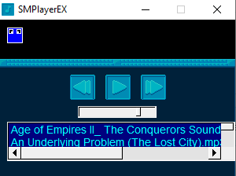

# SMPlayerEx

This is a mini music player for Windows XP, Win 7, Win 8 and Win 10, It will look for your music in the Windows user folder.
It only recognizes the mp3 format.

## Dependences:
FLTK: https://www.fltk.org/
Miniaudio: https://github.com/mackron/miniaudio/blob/master/miniaudio.h
